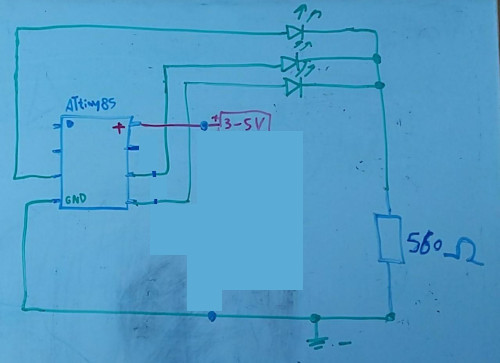

# ATtiny85 Xmas Candle

Use a ATtiny85 8pin AVR chip and some 3mm color LEDs as a xmas candle.

This **is a NOT STORMY** version :-D

You can use this [3mm LED](https://www.aliexpress.com/item/100pcs-lot-F3-10-Colors-3MM-Round-Green-Yellow-Blue-White-Red-Warm-White-Orange-Purple/32815076856.html)
for example.

## Circuit

